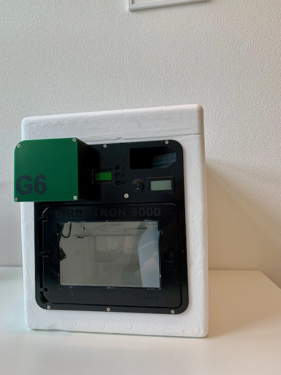
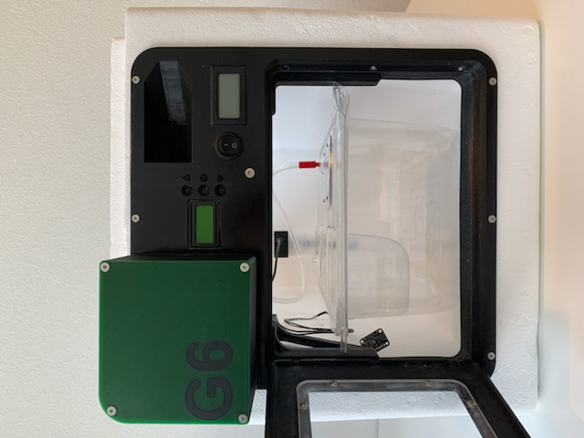
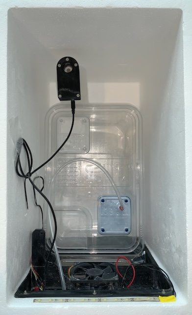
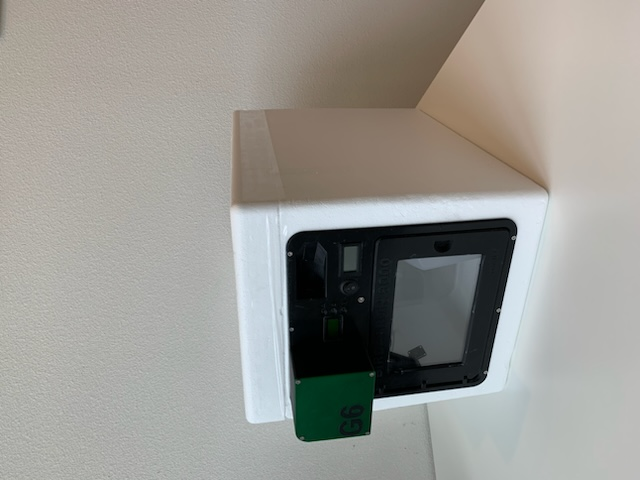

<h1 align="left">OvoEasy</h1>

<p align="left">
  <em>Open-hardware incubators for axenically rearing oviparous vertebrates</em><br>
  Trevelline Lab
</p>

<p align="center">
  
</p>

---

## What is OvoEasy?

**OvoEasy is a low-cost, open-hardware incubator system for raising egg-laying
(oviparous) vertebrates under sterile — axenic — conditions.**

Testing what gut microbiota actually *do* for a host requires raising animals with
no microbes at all, then adding them back under controlled conditions. In
vertebrates this has historically demanded expensive gnotobiotic facilities, which
exist for only a handful of laboratory and agricultural model organisms. Most
oviparous terrestrial vertebrates — the majority of terrestrial vertebrate species —
have been out of reach.

OvoEasy is built to close that gap. The system provides:

- **Automated forced-air heating and humidification**, with independent temperature
  and humidity control
- **Programmable setpoints** — for example 37.5 °C at 55% RH through incubation,
  stepping up to 70% RH for the final 48 hours before hatch
- **Compatibility with HEPA-filtered isolator cages** (e.g. Innovive MSX4), so eggs
  and hatchlings remain sealed from environmental microbes
  
The approach was developed to rear axenic House sparrows (*Passer domesticus*)
nestlings, and can be applied to any oviparous vertebrate whose hatchlings
can be reared in captivity (e.g., birds,reptiles, and amphibians).

## About this repository

This is the **umbrella repository** for the OvoEasy project. It ties the project's
component repositories together as **git submodules** and provides citable,
version-pinned snapshots for each manuscript in the series. Each branch pins the
exact commit of every component used at a given stage, so a publication can
reference one umbrella tag and have the entire hardware/software state reproduced
exactly.

### This branch: `main` — Birdatron 9000

`main` documents the **Birdatron 9000**, the previous-generation incubator that is
the subject of the **first publication** in the series: "Gut microbiota promote digestive function in songbirds" by Trevelline et al. It contains a single component:

| Component | Repository | Description |
| --- | --- | --- |
| Birdatron 9000 | [tanaes/birdatron_9000](https://github.com/tanaes/birdatron_9000) | Build specs for the Birdatron 9000 incubator |

The next-generation **OvoEasy** redesign (PCB, controller code, printed parts and
assembly) is developed on the [`dev`](https://github.com/TrevellineLab/OvoEasy/tree/dev)
branch. As the redesign is published, `dev` will be promoted to `main` and the
Birdatron 9000 will be demoted from a submodule to a referenced citation (a
link/footnote rather than embedded content).

## The Birdatron 9000

The unit is built around an insulated chamber that accepts a standard HEPA-filtered
isolator cage. Sterile, humidified air is delivered through a 0.22 µm in-line filter;
temperature and humidity are held at setpoint by a microcontroller driving a
forced-air heater and a humidification pump.

|  |  |
| :--: | :--: |
|  |  |
| Isolator cage seated in the chamber, with the sterile air line entering through the lid port. | Electronics bay: humidification pump, 0.22 µm in-line filter, and microcontroller. |
|  |  |
| Chamber interior: rear-mounted sensor, base-plate circulation fan, and LED strip. | The insulated chamber, closed. |

> **Note:** these photographs show the Birdatron 9000 as used in the first
> manuscript. They do not depict the OvoEasy redesign, which is under development on
> `dev` and will be documented separately.

## Branches

| Branch | Purpose | Components |
| --- | --- | --- |
| `main` | First manuscript — Birdatron 9000 | `birdatron_9000` |
| `dev` | Next-generation OvoEasy integration | `OvoEasy_Assembly`, `OvoEasy_Code`, `PCBs/*` (+ `birdatron_9000`, for now) |

## Cloning

```bash
git clone --recurse-submodules https://github.com/TrevellineLab/OvoEasy.git
```

Already cloned without submodules?

```bash
git submodule update --init --recursive
```

Switching branches changes which components are present, so re-sync after a checkout:

```bash
git checkout dev
git submodule update --init --recursive
```

## Releasing versioned snapshots for publications

A manuscript cites **one umbrella tag** and gets the complete, exact state of every
component reproduced. This works because each component is a **git submodule** — a
submodule records a single specific commit of the component, not "whatever is latest".

A release is a two-level freeze:

1. Freeze each **component** repo at the exact commit the paper uses (tag it there).
2. Point this umbrella's submodules at those commits, commit, and **tag the umbrella**.

The umbrella tag is the citable artifact.

### Release checklist

- [ ] Freeze and tag every component repo
- [ ] Re-point umbrella submodules; verify with `git submodule status`
- [ ] **Reserve the Zenodo DOI and paste it into this README** (see [How to cite](#how-to-cite))
- [ ] **Replace the preprint placeholder with the posted DOI**
- [ ] Commit, tag the umbrella, push with `--follow-tags`
- [ ] Cut the GitHub Release and attach the recursive bundle
- [ ] Publish the Zenodo deposition

### Tag naming conventions

| Level | Convention | Example |
| --- | --- | --- |
| Component repo | semantic version | `v1.0.0` |
| Component repo (paper-scoped, optional) | `<paper>-vX.Y` | `paper1-v1.0` |
| Umbrella | `<paper>-<focus>-vX.Y` | `paper1-birdatron-v1.0` |

Use **annotated** tags (`git tag -a`) so each tag carries a message, date, and author.

### Procedure

Run on the branch the manuscript publishes from (`main` for the Birdatron paper).

**1. Freeze each component repo** — check out the exact commit and tag it:

```bash
cd <component-checkout>
git checkout <commit-or-branch>
git tag -a paper1-v1.0 -m "State used for <manuscript>, <date>"
git push origin paper1-v1.0
```

**2. Point the umbrella's submodules at those tags** — from the umbrella working copy:

```bash
git checkout main                # the branch you are releasing
git -C birdatron_9000 fetch --tags
git -C birdatron_9000 checkout paper1-v1.0
git add birdatron_9000
# On dev, repeat for OvoEasy_Assembly, OvoEasy_Code, PCBs/incubator_controller, PCBs/light_bar.
git submodule status             # verify each pointer; a leading '+' means it drifted — re-add
```

**3. Commit and tag the umbrella:**

```bash
git commit -m "Freeze components for <manuscript> (paper1 v1.0)"
git tag -a paper1-birdatron-v1.0 -m "<manuscript> — frozen component set"
git push origin main --follow-tags
```

**4. Cut a GitHub Release:**

```bash
gh release create paper1-birdatron-v1.0 \
  --title "Paper 1 — Birdatron 9000 (v1.0)" \
  --notes "Frozen component set for <manuscript>."
```

**5. (Recommended) Archive to Zenodo for a DOI.** Enable the GitHub ↔ Zenodo
integration; publishing a Release creates a citable DOI.

> **Zenodo + submodules gotcha:** Zenodo's automatic archive captures only *this*
> repo's tree (the submodule **pointers**, not the component files). For a
> self-contained archive, build a recursive bundle and attach it to the Release:
>
> ```bash
> # pip install git-archive-all
> git-archive-all --prefix=OvoEasy-paper1-v1.0/ OvoEasy-paper1-v1.0.tar.gz
> gh release upload paper1-birdatron-v1.0 OvoEasy-paper1-v1.0.tar.gz
> ```

> **DOI ordering gotcha:** Zenodo mints the DOI when you publish, so a README frozen
> inside the archive cannot contain its own DOI. Use Zenodo's **reserve DOI** button on
> the draft deposition, paste the reserved DOI into this README, commit, *then*
> publish. Alternatively, cite the version-independent **concept DOI**, which always
> resolves to the latest release.

### Reproducing a published version

```bash
git clone --recurse-submodules https://github.com/TrevellineLab/OvoEasy.git
cd OvoEasy
git checkout paper1-birdatron-v1.0
git submodule update --init --recursive
git submodule status             # every component now at its frozen commit
```

### Notes

- **Where components live.** Submodules point at the `tanaes/*` repositories where the
  work is developed. If a component later moves into the `TrevellineLab` org, update
  its URL in `.gitmodules`, run `git submodule sync`, commit, and cut a new version.
- **Never cite a moving branch** — always tag. A submodule left on a branch drifts
  silently.

## How to cite

If you use this hardware in your research, please cite both the software/hardware
archive and the manuscript describing it.

**Manuscript** — *not yet posted; placeholder*

> Trevelline, B.K., Houtz, J.L., Andreadis, C.R., Sanders, J.G., Collins, M.K.,
> Morris, N.J., Kelly, T.R., Rowe, M., and Moeller, A.H. Gut microbiota promote
> early-life digestive function in songbirds. *bioRxiv* (2026).
> doi: `TBD — AWAITING BIORXIV POSTING`

**Hardware / software archive** — *placeholder*

> Trevelline Lab. OvoEasy: open-hardware incubators for axenically rearing oviparous
> vertebrates. Zenodo. doi: `TBD — RESERVE ON ZENODO BEFORE PUBLISHING`

## License

`TBD.` Open-hardware projects generally need two licenses: one for code (e.g. MIT,
BSD-3-Clause, GPL-3.0) and one for hardware designs and documentation (e.g.
CERN-OHL-S, CC-BY-4.0). Until a `LICENSE` file is added, default copyright applies
and others cannot legally reuse this work.

## Contact

Questions, build reports, and issues are welcome via
[GitHub Issues](https://github.com/TrevellineLab/OvoEasy/issues).

Brian K. Trevelline — Department of Biological Sciences, Kent State University —
btrevell@kent.edu
